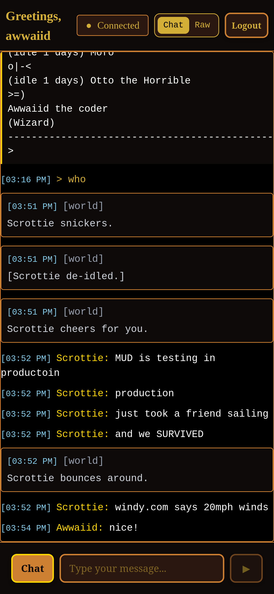

# WeeHours Pub Client

Technically it is a whole-mud client I guess, but I am only optimizing for chatting in the pub.

## Architecture

An express/nextjs app, typescript, that runs on my cloud server. I connect to it with a browser, and the server in turn connects to weehours.net. If I disconnect the browser the connection to weehours persists. I used to do this with the IRC gateway, but wanted something different.

The browser uses websockets to the server for push updates.

Data is stored in a local sqlite.

I have it pretty hard-wired to weehours, but will work for other MUDS probably.

## Deployment

I have it running on my server behind an nginx-proxy that provides SSL and
path-routing. It is booted up via docker-compose, like my other services.

## TODO

* Maybe switch to more machine-friendly API. Or not, it seems to work fine
* I wish there were ways for me to test this without it being annoying to other pub patrons :)

